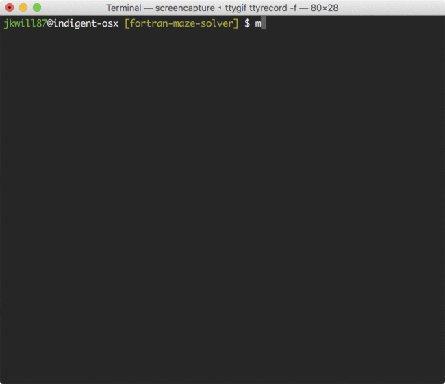

# fortran-maze-solver

A plaintext maze solving program which uses a variation of Trémaux depth first algorithm.

## Compilation

* Execute 'make' from within the project directory; default build prints to stdout using terminal colour escape sequences.
* Alternatively, compile with 'make nocolour' to compile without escape sequences
* In either case a binary named fms will be moved to the 'bin' directory relative to project directory; if this directory does not exist it will be created by the make file.
* Builds using gfortran; requires version 4.6+.

## Running the Program

* You can optionally pass the path of a maze file as a parameter to fms.
* Else, if no parameters are provided, you will be prompted for the path upon execution.
* The program will output a solution to the passed maze via stdout.

## Notes

* Each maze must have a single entrance and exit.
* Can solve closed mazes with the following formatted elements:
	- An asterix `*` for maze walls.
	- A period `.` for passages.
	- An `o` for the maze entrance.
	- An `e` for the maze exit.
